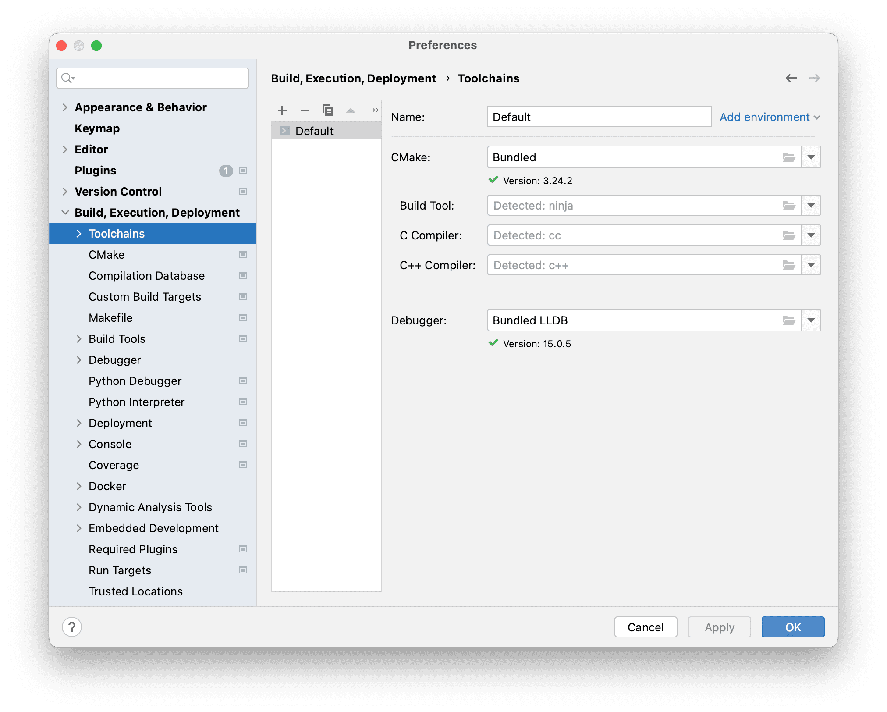
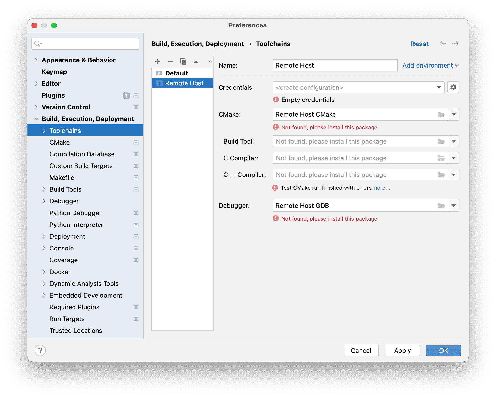
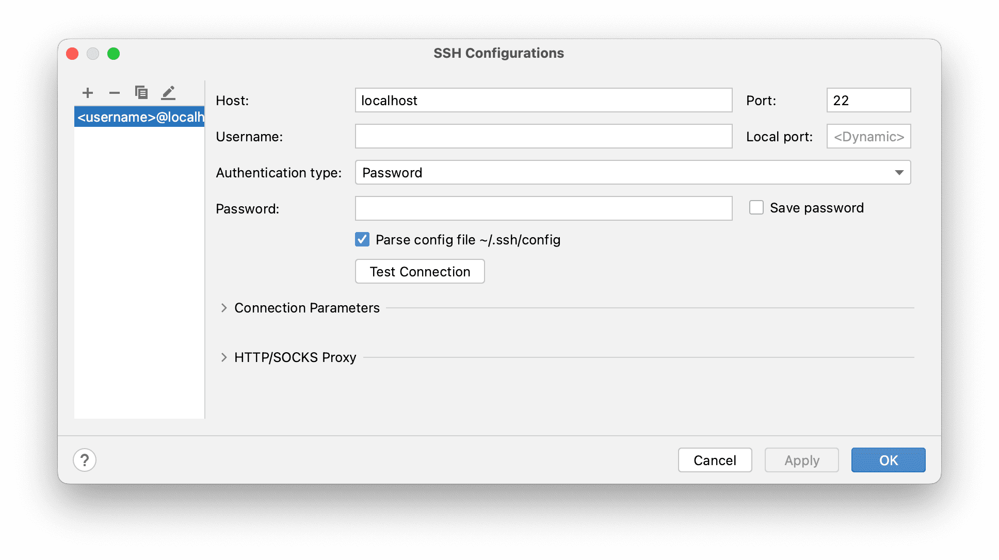
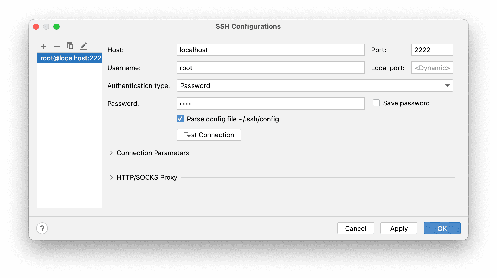
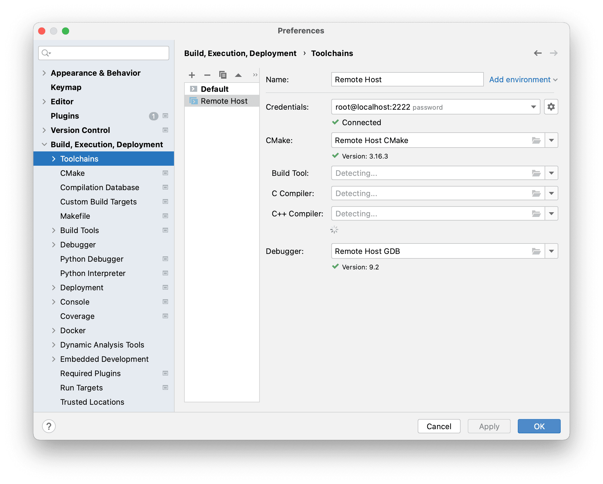
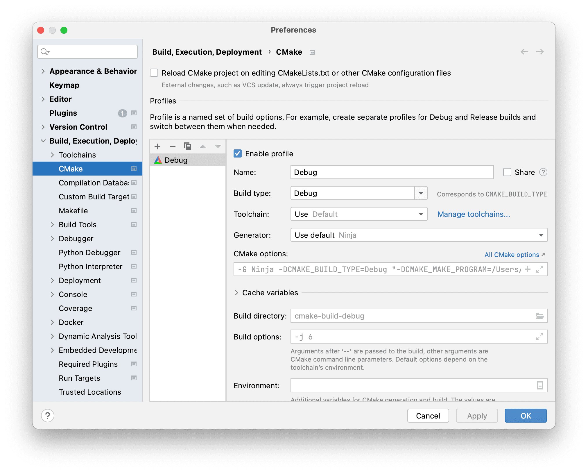
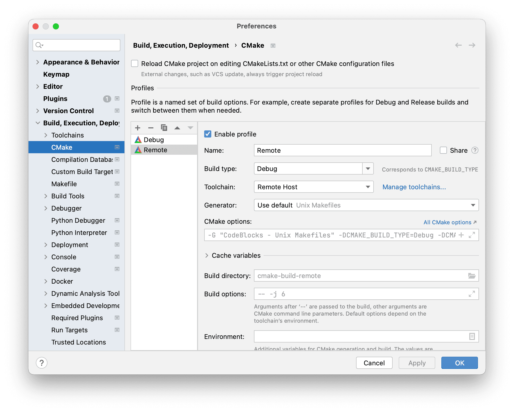
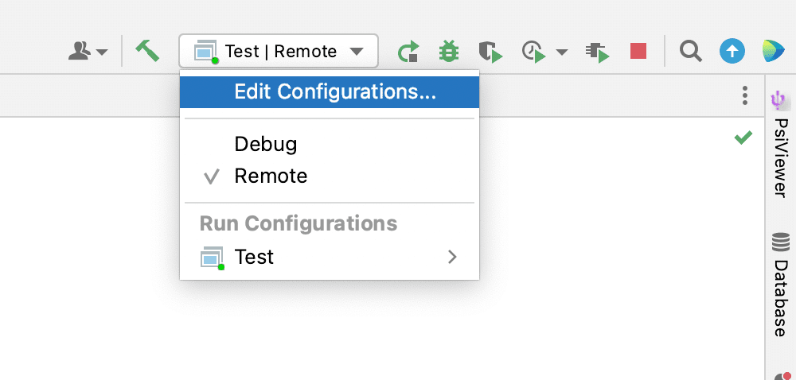

## Проблема

Давайте представим, что мы пишем поддержку ...

## Состав

- TODO

## Порты

- 22 -> 2222 для SSH
- 7777 -> 7777 для gdb

## Настройка

1. `docker-compose up`
2. Открыть CLion
3. Перейти <kbd>Preferences</kbd> > <kbd>Build, Execution, Deployment</kbd> > <kbd>Toolchains</kbd>
   
4. Добавить через <kbd>➕</kbd> новый тип <kbd>Remote Host</kbd>
   
5. Нажать на <kbd>⚙️</kbd> в <kbd>Credentials</kbd>
6. Создать новое подключение через <kbd>➕</kbd>
   
7. Заполнить поля <kbd>Host</kbd>, <kbd>Port</kbd>, <kbd>Username</kbd>, <kbd>Password</kbd>
   
8. По итогу должна получиться такая картина:
   
9. Перейти <kbd>Preferences</kbd> > <kbd>Build, Execution, Deployment</kbd> > <kbd>CMake</kbd>
   
10. Скопировать или создать новый профиль
11. Дать название профиля в поле <kbd>Name</kbd>
12. Поменять <kbd>Toolchains</kbd> на <kbd>Remote Host</kbd>
    
13. При запуске, поменять профиль на созданный
    

## Возможные проблемы

- Возможно Docker будет резать по правам
- Проблемы с GDB ??? (не проверял)

## Переделать / Доделать

- Прокидывание root пароля с env файла для ssh
- Скрипт для запуска
- Перенести сборку в отдельный файл
- Улучить ИБ
- Вынести настройки портов в отдельный конфиг
