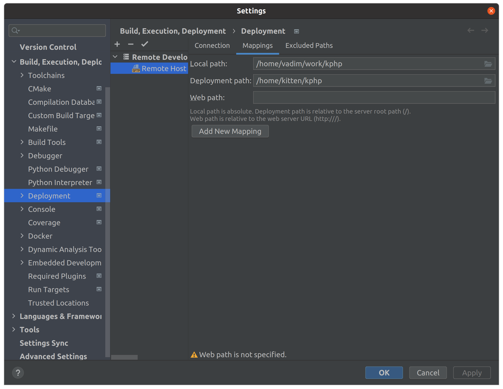

## Проблема

При разработке KPHP могут появиться проблемы с различными библиотеками.
Например, если мы хотим добавить поддержку каких-то баз данных, но не можем
установить все пакеты локально

## Состав

- TODO

## Порты

- `22` -> `2222` для SSH
- `7777` -> `7777` для gdb

## Настройка

1. `docker-compose up -d`
2. Открыть CLion
3. Перейти <kbd>Preferences</kbd> > <kbd>Build, Execution, Deployment</kbd> > <kbd>Toolchains</kbd>
   
4. Добавить через <kbd>➕</kbd> новый тип <kbd>Remote Host</kbd>
   
5. Нажать на <kbd>⚙️</kbd> в <kbd>Credentials</kbd>
6. Создать новое подключение через <kbd>➕</kbd>
   
7. Заполнить поля <kbd>Host</kbd>, <kbd>Port</kbd>, <kbd>Username</kbd>, <kbd>Password</kbd>
   > Используем логин `kitten`

   
8. По итогу должна получиться такая картина:
   
9. Перейти <kbd>Preferences</kbd> > <kbd>Build, Execution, Deployment</kbd> > <kbd>CMake</kbd>
   
10. Скопировать или создать новый профиль
11. Дать название профиля в поле <kbd>Name</kbd>
12. Поменять <kbd>Toolchains</kbd> на <kbd>Remote Host</kbd>
    
13. При запуске, поменять профиль на созданный
    
14. Перейти <kbd>Preferences</kbd> > <kbd>Build, Execution, Deployment</kbd> > <kbd>Deployment</kbd>
    
15. Изменить Deployment path на /home/kitten/kphp
    
16. Также cmake файлы KPHP используют папку .git. Изначально она не доставляется в контейнер
Для этого требуется перейти <kbd>Tools</kbd> > <kbd>Deployment</kbd> > <kbd>Options</kbd> и удалить
.git из списка Exclude
    

## Возможные проблемы

- Возможно Docker будет резать по правам
- Проблемы с GDB ??? (не проверял)

# Примечание

- После изменения в `Dockerfile` не забываем добавлять флаг `--build`

## Переделать / Доделать

> Часть документации актуализирует @Ramzeeset

- Прокидывание root пароля с env файла для ssh
- Скрипт для запуска
- Перенести сборку в отдельный файл
- Улучить ИБ
- Вынести настройки портов в отдельный конфиг
- Описать проблему с профилями
- Описать проблему с SSH ключами / чейнами
- Описать сложность с Deployment
